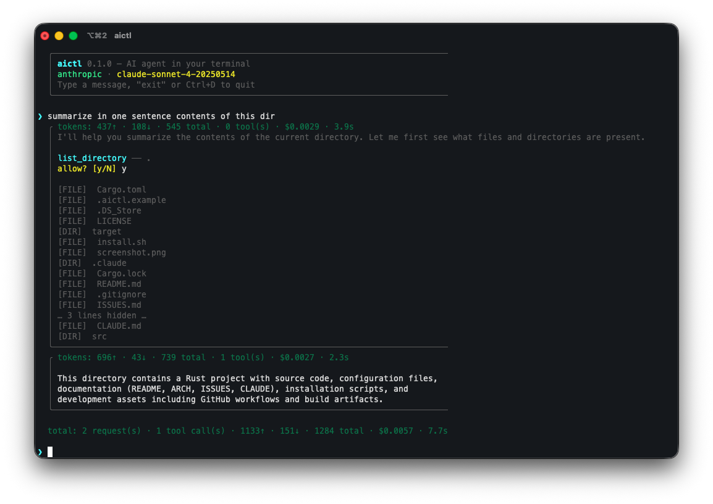

# aictl 🤖

[](https://github.com/pwittchen/aictl/actions/workflows/ci.yml)
[](https://github.com/pwittchen/aictl/actions/workflows/release.yml)

AI agent in your terminal



## Install

```bash
curl -sSf https://raw.githubusercontent.com/pwittchen/aictl/master/install.sh | sh
```

### Prerequisites

- [Rust](https://www.rust-lang.org/tools/install) (edition 2024)

### From source

```bash
git clone git@github.com:pwittchen/aictl.git
cd aictl
cargo install --path .
```

This installs the `aictl` binary to `~/.cargo/bin/`.

### Build without installing

```bash
cargo build --release
```

The binary will be at `target/release/aictl`.

## Usage

```bash
aictl [--version] [--update] [--provider <PROVIDER>] [--model <MODEL>] [--message <MESSAGE>] [--auto] [--quiet] [--unrestricted]
```

Omit `--message` to enter interactive REPL mode with persistent conversation history.

### REPL Commands

The interactive REPL supports slash commands:

| Command | Description |
|---------|-------------|
| `/clear` | Clear conversation context |
| `/compact` | Summarize conversation into a compact context |
| `/context` | Show context usage (token and message counts vs limits) |
| `/copy` | Copy last response to clipboard |
| `/help` | Show available commands |
| `/info` | Show setup info (provider, model, behavior, thinking, version, OS, binary size) |
| `/issues` | Fetch and display known issues from the remote ISSUES.md |
| `/security` | Show current security policy (blocked commands, CWD jail, timeouts, etc.) |
| `/thinking` | Switch thinking mode: smart (all messages) or fast (sliding window) |
| `/behavior` | Switch between auto and human-in-the-loop mode during the session |
| `/model` | Switch model and provider during the session (persists to `~/.aictl`) |
| `/tools` | Show available tools |
| `/update` | Update to the latest version |
| `/exit` | Exit the REPL |

Press **Esc** during any LLM call or tool execution to interrupt the operation and return to the prompt. Conversation history is rolled back so the interrupted turn has no effect.

### Parameters

| Flag | Short | Description |
|------|-------|-------------|
| `--version` | `-V` | Print version information |
| `--update` | `-u` | Update to the latest version |
| `--provider` | `-p` | LLM provider (`openai`, `anthropic`, `gemini`, `grok`, `mistral`, `deepseek`, `zai`, or `ollama`). Falls back to `AICTL_PROVIDER` in `~/.aictl` |
| `--model` | `-M` | Model name (e.g. `gpt-4o`). Falls back to `AICTL_MODEL` in `~/.aictl` |
| `--message` | `-m` | Message to send (omit for interactive mode) |
| `--auto` | `-a` | Run in autonomous mode (skip tool confirmation prompts) |
| `--quiet` | `-q` | Suppress tool calls and reasoning, only print the final answer (requires `--auto`) |
| `--unrestricted` | `-U` | Disable all security restrictions (use with caution) |

CLI flags take priority over config file values.

### Configuration

Configuration is loaded from `~/.aictl`. This is a single global config file — the program works the same regardless of the current working directory.

#### Basic configuration

`FIRECRAWL_API_KEY` is optional and is needed only if you want to use `search_web` tool.

Not all API keys are required. You need to provide only those, for which you set `AICTL_PROVIDER` and `AICTL_MODEL`.

If you want to use multiple LLM providers, then you need to provide appropriate keys.

| Key | Description |
|-----|-------------|
| `AICTL_PROVIDER` | Default provider (`openai`, `anthropic`, `gemini`, `grok`, `mistral`, `deepseek`, `zai`, or `ollama`) |
| `AICTL_MODEL` | Default model name |
| `AICTL_THINKING` | Thinking mode: `smart` (all messages, default) or `fast` (sliding window) |
| `LLM_OPENAI_API_KEY` | API key for OpenAI |
| `LLM_ANTHROPIC_API_KEY` | API key for Anthropic |
| `LLM_GEMINI_API_KEY` | API key for Google Gemini |
| `LLM_GROK_API_KEY` | API key for xAI Grok |
| `LLM_MISTRAL_API_KEY` | API key for Mistral |
| `LLM_DEEPSEEK_API_KEY` | API key for DeepSeek |
| `LLM_ZAI_API_KEY` | API key for Z.ai |
| `AICTL_OLLAMA_BASE_URL` | Ollama server URL (default: `http://localhost:11434`) |
| `FIRECRAWL_API_KEY` | API key for Firecrawl (`search_web` tool) |

#### Security configuration (optional)

| Key | Description |
|-----|-------------|
| `AICTL_SECURITY` | Master security switch (default: `true`) |
| `AICTL_SECURITY_CWD_RESTRICT` | Restrict file tools to working directory (default: `true`) |
| `AICTL_SECURITY_SHELL_ALLOWED` | Comma-separated whitelist of allowed shell commands (empty = all except blocked) |
| `AICTL_SECURITY_SHELL_BLOCKED` | Additional blocked shell commands (added to built-in defaults) |
| `AICTL_SECURITY_BLOCK_SUBSHELL` | Block `$()`, backticks, and process substitution (default: `true`) |
| `AICTL_SECURITY_BLOCKED_PATHS` | Additional blocked file paths (added to built-in defaults) |
| `AICTL_SECURITY_ALLOWED_PATHS` | Paths allowed outside the working directory |
| `AICTL_SECURITY_SHELL_TIMEOUT` | Shell command timeout in seconds (default: `30`) |
| `AICTL_SECURITY_MAX_WRITE` | Max file write size in bytes (default: `1048576` = 1 MB) |
| `AICTL_SECURITY_DISABLED_TOOLS` | Comma-separated tool names to disable (e.g. `exec_shell,search_web`) |
| `AICTL_SECURITY_BLOCKED_ENV` | Additional env vars to scrub from shell subprocesses |

Create `~/.aictl` (see `.aictl.example`):

```
AICTL_PROVIDER=anthropic
AICTL_MODEL=claude-sonnet-4-20250514
LLM_ANTHROPIC_API_KEY=sk-ant-...
FIRECRAWL_API_KEY=fc-...
```

The file format supports comments (`#`), quoted values, and optional `export` prefixes.

### Providers

aictl supports eight LLM providers:

#### OpenAI

Requires `LLM_OPENAI_API_KEY`. Supported models with cost estimates (input/output per 1M tokens):

| Model | Input | Output |
|-------|-------|--------|
| `gpt-4.1-nano` | $0.10 | $0.40 |
| `gpt-4.1-mini` | $0.40 | $1.60 |
| `gpt-4.1` | $2.00 | $8.00 |
| `gpt-4o-mini` | $0.15 | $0.60 |
| `gpt-4o` | $2.50 | $10.00 |
| `gpt-5-mini` | $0.25 | $2.00 |
| `gpt-5` | $1.25 | $10.00 |
| `o4-mini` | $1.10 | $4.40 |
| `o3` | $2.00 | $8.00 |
| `o1` | $15.00 | $60.00 |

#### Anthropic

Requires `LLM_ANTHROPIC_API_KEY`. Supported models with cost estimates (input/output per 1M tokens):

| Model | Input | Output |
|-------|-------|--------|
| `claude-haiku-*` (3.x) | $0.25 | $1.25 |
| `claude-haiku-4-*` | $1.00 | $5.00 |
| `claude-sonnet-*` | $3.00 | $15.00 |
| `claude-opus-4-5-*` / `claude-opus-4-6-*` | $5.00 | $25.00 |
| `claude-opus-4-*` (older) | $15.00 | $75.00 |

#### Google Gemini

Requires `LLM_GEMINI_API_KEY`. Supported models with cost estimates (input/output per 1M tokens):

| Model | Input | Output |
|-------|-------|--------|
| `gemini-2.5-pro` | $1.25 | $10.00 |
| `gemini-2.5-flash` | $0.15 | $0.60 |
| `gemini-2.0-flash` | $0.10 | $0.40 |

#### xAI Grok

Requires `LLM_GROK_API_KEY`. Supported models with cost estimates (input/output per 1M tokens):

| Model | Input | Output |
|-------|-------|--------|
| `grok-3` | $3.00 | $15.00 |
| `grok-3-mini` | $0.30 | $0.50 |

#### Mistral

Requires `LLM_MISTRAL_API_KEY`. Supported models with cost estimates (input/output per 1M tokens):

| Model | Input | Output |
|-------|-------|--------|
| `mistral-large-latest` | $2.00 | $6.00 |
| `mistral-medium-latest` | $0.40 | $2.00 |
| `mistral-small-latest` | $0.10 | $0.30 |
| `codestral-latest` | $0.30 | $0.90 |

#### DeepSeek

Requires `LLM_DEEPSEEK_API_KEY`. Supported models with cost estimates (input/output per 1M tokens):

| Model | Input | Output |
|-------|-------|--------|
| `deepseek-chat` | $0.27 | $1.10 |
| `deepseek-reasoner` | $0.55 | $2.19 |

#### Z.ai

Requires `LLM_ZAI_API_KEY`. Supported models with cost estimates (input/output per 1M tokens):

| Model | Input | Output |
|-------|-------|--------|
| `glm-5` | $0.72 | $2.30 |
| `glm-4.7` | $0.39 | $1.75 |
| `glm-4.7-flash` | $0.06 | $0.40 |

#### Ollama

Ollama runs models locally — no API key required. Install Ollama from [ollama.com](https://ollama.com), pull a model, and start the server:

```bash
ollama pull llama3.2
ollama serve
```

Then configure aictl to use it:

```
AICTL_PROVIDER=ollama
AICTL_MODEL=llama3.2:latest
```

Available models are detected automatically from your local Ollama instance via the REST API. The `/model` command shows only models you have pulled locally. If Ollama is not running, it will not appear in the model menu.

By default, aictl connects to `http://localhost:11434`. To use a different address, set `AICTL_OLLAMA_BASE_URL` in `~/.aictl`.

All Ollama models are free (self-hosted), so cost estimation shows $0.00.

Any model string can be passed via `--model`; cost estimation uses pattern matching on the model name and falls back to zero if unrecognized.

### Agent Loop & Tool Calling

aictl runs an agent loop: the LLM can invoke tools, see their results, and continue reasoning until it produces a final answer.

By default, every tool call requires confirmation (y/N prompt). Use `--auto` to skip confirmation and run autonomously.

Available tools:

| Tool | Description |
|------|-------------|
| `exec_shell` | Execute a shell command via `sh -c` |
| `read_file` | Read the contents of a file |
| `write_file` | Write content to a file (first line = path, rest = content) |
| `remove_file` | Remove (delete) a file (regular files only, not directories) |
| `create_directory` | Create a directory and any missing parent directories |
| `list_directory` | List files and directories at a path with `[FILE]`/`[DIR]`/`[LINK]` prefixes |
| `search_files` | Search file contents by pattern (grep regex) with optional directory scope |
| `edit_file` | Apply a targeted find-and-replace edit to a file (exact unique match required) |
| `search_web` | Search the web via Firecrawl API (requires `FIRECRAWL_API_KEY`) |
| `find_files` | Find files matching a glob pattern (e.g. `**/*.rs`) with optional base directory |
| `fetch_url` | Fetch a URL and return readable text content (HTML tags stripped) |
| `extract_website` | Fetch a URL and extract only the main readable content (strips scripts, styles, nav, boilerplate) |
| `fetch_datetime` | Get the current date, time, timezone, and day of week |
| `fetch_geolocation` | Get geolocation data for an IP address (city, country, timezone, coordinates, ISP) via ip-api.com |

The tool-calling mechanism uses a custom XML format in the LLM response text (not provider-native tool APIs):

```xml
<tool name="exec_shell">
ls -la /tmp
</tool>
```

The agent loop runs for up to 20 iterations. LLM reasoning is printed to stderr; the final answer goes to stdout. Token usage, estimated cost, and execution time are always displayed after each response.

### Security

All tool calls pass through a configurable security policy (`src/security.rs`) before execution. By default:

- **Shell command blocking**: dangerous commands are blocked (`rm`, `sudo`, `dd`, `mkfs`, `nc`, etc.). Command substitution (`$(...)`, backticks) is blocked. Compound commands (`|`, `&&`, `||`, `;`) are split and each segment is validated independently.
- **CWD jail**: file tools (`read_file`, `write_file`, `remove_file`, `edit_file`, `create_directory`, `list_directory`, `search_files`, `find_files`) can only operate within the working directory. Path traversal via `..` is defeated by canonicalization.
- **Blocked paths**: sensitive paths are always blocked (`~/.ssh`, `~/.gnupg`, `~/.aictl`, `~/.aws`, `~/.config/gcloud`, `/etc/shadow`, `/etc/sudoers`).
- **Environment scrubbing**: shell subprocesses receive a clean environment — vars matching `*_KEY`, `*_SECRET`, `*_TOKEN`, `*_PASSWORD` are stripped so API keys cannot leak.
- **Shell timeout**: commands are killed after 30 seconds (configurable).
- **Write size limit**: file writes are capped at 1 MB (configurable).
- **Output sanitization**: tool results are sanitized to prevent prompt injection via `<tool>` tags.

Security denials are returned to the LLM as tool results (displayed in red) so it can adapt. Use `--unrestricted` to disable all security checks. Individual settings are configurable via `AICTL_SECURITY_*` keys in `~/.aictl`.

### Examples

```bash
# With defaults configured in ~/.aictl, just run:
aictl

# Or send a single message:
aictl -m "What is Rust?"

# Override provider/model from the command line:
aictl -p openai -M gpt-4o -m "What is Rust?"

# Agent with tool calls (interactive confirmation)
aictl -m "List files in the current directory"

# Autonomous mode (no confirmation prompts)
aictl --auto -m "What OS am I running?"

# Quiet mode (only final answer, no tool calls or reasoning)
aictl --auto -q -m "What OS am I running?"
```

## Tests

```bash
cargo test
```

Unit tests cover core logic across six modules: `commands` (slash command parsing), `config` (config file parsing), `tools` (tool-call XML parsing), `ui` (formatting helpers), `llm` (cost estimation and model matching), and `security` (shell validation, path validation, output sanitization).

## Architecture

See [ARCH.md](ARCH.md) for detailed ASCII diagrams covering:

- Module structure
- Startup flow
- Agent loop
- Tool execution dispatch
- LLM provider abstraction
- UI layer
- End-to-end data flow

## Claude Code Skills

This project includes [Claude Code](https://claude.ai/code) skills for common workflows. Run them as slash commands in a Claude Code session:

| Skill | Description |
|-------|-------------|
| `/commit` | Commit staged and unstaged changes with a clear commit message |
| `/update-docs` | Update README.md, CLAUDE.md, and ARCH.md to match the current project state |
| `/evaluate-rust-quality` | Audit code quality, idiomatic Rust usage, and best practices |
| `/evaluate-rust-security` | Audit security posture, injection risks, and credential handling |
| `/evaluate-rust-performance` | Audit performance patterns, allocations, and CLI responsiveness |

Evaluation reports are saved to `.claude/reports/` with timestamped filenames.

## Known Issues & Ideas

See [ISSUES.md](ISSUES.md) for a list of known issues and planned improvements.

## License

This project is licensed under the [PolyForm Noncommercial License 1.0.0](LICENSE). It is free to use for non-commercial purposes, including personal use, research, education, and use by non-profit organizations. For commercial use, please contact [piotr@wittchen.io](mailto:piotr@wittchen.io).
